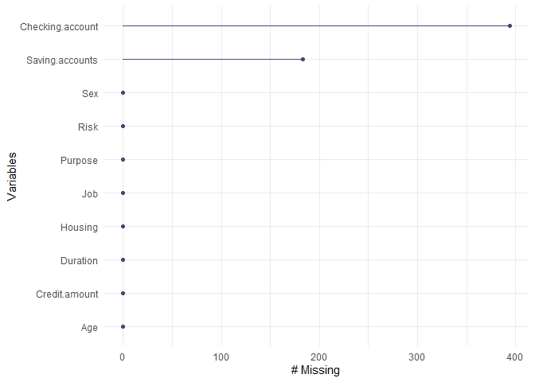
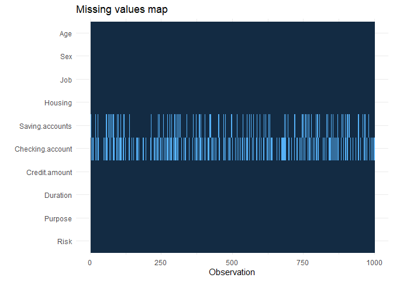
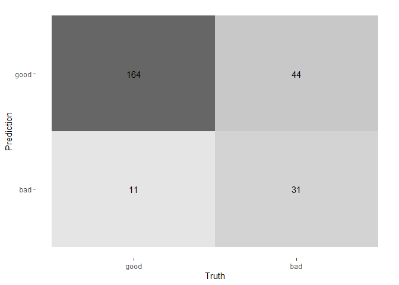

Credit Risk with tidymodels
================
Fabien Mata
23/04/2021

### Load tidymodels packages

``` r
library(tidymodels) #containing rsample, recipe, parsnip, tune , yardstick
library(naniar) #NA handling
library(finalfit) #NA handling
library(workflowsets) 
###engines for parsnip models 
library(glmnet) #for regularised logistic 
library(rpart) #for decision tree
library(randomForest) #self explaining
library(klaR) #for discriminant analysis (engine)
library(discrim) #for discriminant analysis (function)
library(kknn) #for nearest neighbor
library(kernlab) #for support vector machine
```

The data is from kaggle (‘german credit risk’) It contains 10 variables,
where

``` r
risk <- read.csv("https://raw.githubusercontent.com/fabienmata/tidymodels/master/data/german_credit_data.csv", 
                 row.names = 'X',
                 stringsAsFactors = TRUE)
risk %>% head()
```

    ##   Age    Sex Job Housing Saving.accounts Checking.account Credit.amount
    ## 0  67   male   2     own            <NA>           little          1169
    ## 1  22 female   2     own          little         moderate          5951
    ## 2  49   male   1     own          little             <NA>          2096
    ## 3  45   male   2    free          little           little          7882
    ## 4  53   male   2    free          little           little          4870
    ## 5  35   male   1    free            <NA>             <NA>          9055
    ##   Duration             Purpose Risk
    ## 0        6            radio/TV good
    ## 1       48            radio/TV  bad
    ## 2       12           education good
    ## 3       42 furniture/equipment good
    ## 4       24                 car  bad
    ## 5       36           education good

``` r
risk %>% str()
```

    ## 'data.frame':    1000 obs. of  10 variables:
    ##  $ Age             : int  67 22 49 45 53 35 53 35 61 28 ...
    ##  $ Sex             : Factor w/ 2 levels "female","male": 2 1 2 2 2 2 2 2 2 2 ...
    ##  $ Job             : int  2 2 1 2 2 1 2 3 1 3 ...
    ##  $ Housing         : Factor w/ 3 levels "free","own","rent": 2 2 2 1 1 1 2 3 2 2 ...
    ##  $ Saving.accounts : Factor w/ 4 levels "little","moderate",..: NA 1 1 1 1 NA 3 1 4 1 ...
    ##  $ Checking.account: Factor w/ 3 levels "little","moderate",..: 1 2 NA 1 1 NA NA 2 NA 2 ...
    ##  $ Credit.amount   : int  1169 5951 2096 7882 4870 9055 2835 6948 3059 5234 ...
    ##  $ Duration        : int  6 48 12 42 24 36 24 36 12 30 ...
    ##  $ Purpose         : Factor w/ 8 levels "business","car",..: 6 6 4 5 2 4 5 2 6 2 ...
    ##  $ Risk            : Factor w/ 2 levels "bad","good": 2 1 2 2 1 2 2 2 2 1 ...

``` r
risk %>% gg_miss_var()
```

<!-- -->

see clearly the missing data points

``` r
risk %>% missing_plot()
```

<!-- -->

``` r
risk_split <- initial_split(risk,
                            prop = 0.75,
                            strata = Risk)

risk_training <- risk_split %>% 
  training()

risk_test <- risk_split %>% 
  testing()
```

``` r
risk_rec <- recipe(Risk ~., data = risk_training) %>% 
  #set the event/reference level to 'good'
  step_relevel(Risk, ref_level = 'good') %>% 
  #us the na's to create a new level 
  step_unknown(Saving.accounts, new_level = "no account") %>% 
  step_unknown(Checking.account, new_level = "no account") %>% 
  
  #normalize all numeric variables
  step_normalize(all_numeric()) %>% 
  
  #turn all the factors into dummies and delete the reference level
  step_dummy(all_nominal(), -all_outcomes())
```

``` r
logit_tuned <- logistic_reg(penalty = tune(), 
                                 mixture = tune()) %>%
  set_engine('glmnet') %>%
  set_mode('classification')

#regularised discriminant analysis : a compromise between qda and lda by setting the hyperparameter penalty

rda_tuned <- discrim_regularized(frac_common_cov = tune(),
                                 frac_identity = tune()) %>% 
  set_engine('klaR') %>% 
  set_mode('classification')

#decision tree
dt_tuned <- decision_tree(cost_complexity = tune(),
                               tree_depth = tune(),
                               min_n = tune()) %>%
  set_engine('rpart') %>%
  set_mode('classification')

#random forest 
rf_tuned <- rand_forest(mtry = tune(),
                        trees = tune(),
                        min_n = tune()) %>% 
  set_engine('randomForest') %>%
  set_mode('classification')

#k nearest neighbors
knn_tuned <- nearest_neighbor(neighbors = tune(),
                              weight_func = tune(),
                              dist_power = tune()) %>% 
  set_engine('kknn') %>%
  set_mode('classification')

#support vector machine
svm_poly_tuned <- svm_poly(cost = tune(),
                          degree = tune(),
                          scale_factor = tune()) %>% 
  set_engine('kernlab') %>% 
  set_mode('classification')
```

``` r
#make a list out of the models
models <- list(logit = logit_tuned,
               rda = rda_tuned,
               dt = dt_tuned, 
               rf = rf_tuned,
               knn = knn_tuned,
               svm = svm_poly_tuned)

#incorporate them in a set of workflow
risk_wflow_set <- workflow_set(preproc = list(rec = risk_rec), 
                               models = models, 
                               cross = TRUE)  

#metrics we want for each model 
#we want : accuracy, sensitivity, specificity, area under the roc curve 
risk_metrics <- metric_set(accuracy, sens, spec, roc_auc)

#folds caracteristics for the cross validation 
risk_folds <- vfold_cv(data =  risk_training,
                       #nb of folds
                       v = 5,
                       #outcome variable
                       strata = Risk)
```

``` r
wflow_set_grid_results <- risk_wflow_set %>% 
  workflow_map(
  #tune_grid() parameters
    resamples = risk_folds,
    grid = 10,
    metrics = risk_metrics,
  #workflow_map() own parameters
    seed = 3,
    verbose = TRUE
)
```

    ## i 1 of 6 tuning:     rec_logit

    ## Warning: package 'rlang' was built under R version 4.0.5

    ## Warning: package 'vctrs' was built under R version 4.0.5

    ## v 1 of 6 tuning:     rec_logit (21s)

    ## i 2 of 6 tuning:     rec_rda

    ## v 2 of 6 tuning:     rec_rda (21.8s)

    ## i 3 of 6 tuning:     rec_dt

    ## v 3 of 6 tuning:     rec_dt (21.1s)

    ## i 4 of 6 tuning:     rec_rf

    ## i Creating pre-processing data to finalize unknown parameter: mtry

    ## v 4 of 6 tuning:     rec_rf (1m 5.2s)

    ## i 5 of 6 tuning:     rec_knn

    ## v 5 of 6 tuning:     rec_knn (42.2s)

    ## i 6 of 6 tuning:     rec_svm

    ## v 6 of 6 tuning:     rec_svm (23.3s)

``` r
#rank the models by the area under the roc curve
wflow_set_grid_results %>% 
  rank_results(rank_metric = "roc_auc") %>% 
  filter(.metric == "roc_auc")
```

    ## # A tibble: 60 x 9
    ##    wflow_id  .config     .metric  mean std_err     n preprocessor model     rank
    ##    <chr>     <chr>       <chr>   <dbl>   <dbl> <int> <chr>        <chr>    <int>
    ##  1 rec_logit Preprocess~ roc_auc 0.756  0.0118     5 recipe       logisti~     1
    ##  2 rec_rda   Preprocess~ roc_auc 0.756  0.0159     5 recipe       discrim~     2
    ##  3 rec_rda   Preprocess~ roc_auc 0.754  0.0162     5 recipe       discrim~     3
    ##  4 rec_logit Preprocess~ roc_auc 0.754  0.0109     5 recipe       logisti~     4
    ##  5 rec_logit Preprocess~ roc_auc 0.754  0.0110     5 recipe       logisti~     5
    ##  6 rec_logit Preprocess~ roc_auc 0.754  0.0108     5 recipe       logisti~     6
    ##  7 rec_logit Preprocess~ roc_auc 0.754  0.0109     5 recipe       logisti~     7
    ##  8 rec_logit Preprocess~ roc_auc 0.754  0.0109     5 recipe       logisti~     8
    ##  9 rec_logit Preprocess~ roc_auc 0.754  0.0109     5 recipe       logisti~     9
    ## 10 rec_logit Preprocess~ roc_auc 0.754  0.0109     5 recipe       logisti~    10
    ## # ... with 50 more rows

``` r
#plot the performance of each model by rank
wflow_set_grid_results %>% 
  autoplot(rank_metric= "roc_auc", 
           metric = "roc_auc")
```

<!-- -->

``` r
#take the best result
best_results <- wflow_set_grid_results %>% 
  pull_workflow_set_result("rec_rf") %>% 
  select_best(metric = "roc_auc")

#fit the best model
final_fit <- wflow_set_grid_results %>% 
  pull_workflow("rec_rf") %>% 
  finalize_workflow(best_results) %>% 
  last_fit(risk_split)
```

``` r
final_fit %>% collect_metrics()
```

    ## # A tibble: 2 x 4
    ##   .metric  .estimator .estimate .config             
    ##   <chr>    <chr>          <dbl> <chr>               
    ## 1 accuracy binary         0.78  Preprocessor1_Model1
    ## 2 roc_auc  binary         0.779 Preprocessor1_Model1

``` r
risk_predictions <- final_fit %>% collect_predictions()
conf_mat(risk_predictions,
         truth = Risk,
         estimate = .pred_class) %>%
  autoplot(type = 'heatmap')
```

<!-- -->
