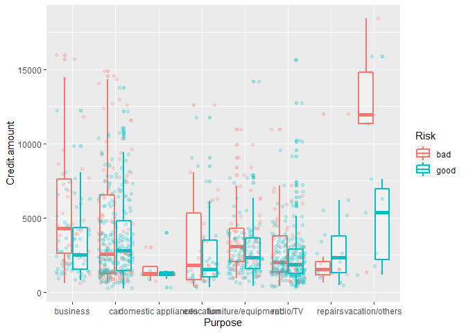

Credit Risk with tidymodels
================
Fabien Mata
23/04/2021

## 1- The data

### Context

The dataset contains 1000 entries with 10 categorical/symbolic
attributes. In this dataset, each entry represents a person who takes a
credit by a bank. Each person is classified as good or bad credit risks
according to the set of attributes. The link to the original dataset can
be found
[here](https://www.kaggle.com/kabure/german-credit-data-with-risk?select=german_credit_data.csv).

### Content

Here are the variables :

1.  Age (numeric)

2.  Sex (text: male, female)

3.  Job (numeric: 0 - unskilled and non-resident, 1 - unskilled and
    resident, 2 - skilled, 3 - highly skilled)

4.  Housing (text: own, rent, or free)

5.  Saving accounts (text - little, moderate, quite rich, rich)

6.  Checking account (numeric, in DM - Deutsch Mark)

7.  Credit amount (numeric, in DM)

8.  Duration (numeric, in month)

9.  Purpose (text: car, furniture/equipment, radio/TV, domestic
    appliances, repairs, education, business, vacation/others)

10. Risk (text : good, bad)

## 2. Packages

The work was done using the tidymodels framework. is a collection of
packages for modeling and machine learning using tidyverse principles.
It is composed of the following packages :

-   ‘rsample’ and ‘recipes’ for preprocessing

-   ‘parsnip’ and ‘tune’ for modeling and model optimization. Parsnip
    depends on several machine learning engines, it then requires the
    presence of each package for each engine.

-   ‘yardstick’ for model validation

‘workfowsets’ is not part of the tidymodels collection of package, event
though it is a part of the **tidymodels** ecosystem. It helps to better
manage machine learning workflows.

``` r
library(tidymodels) 
library(naniar) #NA handling
library(finalfit) #NA handling
library(workflowsets) 
###engines for parsnip models 
library(glmnet) #for regularised logistic 
library(rpart) #for decision tree
library(randomForest) #self explaining
library(klaR) #for discriminant analysis (engine)
library(discrim) #for discriminant analysis (function)
library(kknn) #for nearest neighbor
library(kernlab) #for support vector machine
library(themis)
```

## 3. Exporatory analysis

Let’s take a first look at the data

``` r
risk <- read.csv("https://raw.githubusercontent.com/fabienmata/tidymodels/master/data/german_credit_data.csv", 
                 row.names = 'X',
                 stringsAsFactors = TRUE)
library(kableExtra)
```

    ## Warning: package 'kableExtra' was built under R version 4.0.5

    ## 
    ## Attaching package: 'kableExtra'

    ## The following object is masked from 'package:dplyr':
    ## 
    ##     group_rows

``` r
risk %>% head() %>% kbl() %>% kable_styling()
```

<table class="table" style="margin-left: auto; margin-right: auto;">
<thead>
<tr>
<th style="text-align:left;">
</th>
<th style="text-align:right;">
Age
</th>
<th style="text-align:left;">
Sex
</th>
<th style="text-align:right;">
Job
</th>
<th style="text-align:left;">
Housing
</th>
<th style="text-align:left;">
Saving.accounts
</th>
<th style="text-align:left;">
Checking.account
</th>
<th style="text-align:right;">
Credit.amount
</th>
<th style="text-align:right;">
Duration
</th>
<th style="text-align:left;">
Purpose
</th>
<th style="text-align:left;">
Risk
</th>
</tr>
</thead>
<tbody>
<tr>
<td style="text-align:left;">
0
</td>
<td style="text-align:right;">
67
</td>
<td style="text-align:left;">
male
</td>
<td style="text-align:right;">
2
</td>
<td style="text-align:left;">
own
</td>
<td style="text-align:left;">
NA
</td>
<td style="text-align:left;">
little
</td>
<td style="text-align:right;">
1169
</td>
<td style="text-align:right;">
6
</td>
<td style="text-align:left;">
radio/TV
</td>
<td style="text-align:left;">
good
</td>
</tr>
<tr>
<td style="text-align:left;">
1
</td>
<td style="text-align:right;">
22
</td>
<td style="text-align:left;">
female
</td>
<td style="text-align:right;">
2
</td>
<td style="text-align:left;">
own
</td>
<td style="text-align:left;">
little
</td>
<td style="text-align:left;">
moderate
</td>
<td style="text-align:right;">
5951
</td>
<td style="text-align:right;">
48
</td>
<td style="text-align:left;">
radio/TV
</td>
<td style="text-align:left;">
bad
</td>
</tr>
<tr>
<td style="text-align:left;">
2
</td>
<td style="text-align:right;">
49
</td>
<td style="text-align:left;">
male
</td>
<td style="text-align:right;">
1
</td>
<td style="text-align:left;">
own
</td>
<td style="text-align:left;">
little
</td>
<td style="text-align:left;">
NA
</td>
<td style="text-align:right;">
2096
</td>
<td style="text-align:right;">
12
</td>
<td style="text-align:left;">
education
</td>
<td style="text-align:left;">
good
</td>
</tr>
<tr>
<td style="text-align:left;">
3
</td>
<td style="text-align:right;">
45
</td>
<td style="text-align:left;">
male
</td>
<td style="text-align:right;">
2
</td>
<td style="text-align:left;">
free
</td>
<td style="text-align:left;">
little
</td>
<td style="text-align:left;">
little
</td>
<td style="text-align:right;">
7882
</td>
<td style="text-align:right;">
42
</td>
<td style="text-align:left;">
furniture/equipment
</td>
<td style="text-align:left;">
good
</td>
</tr>
<tr>
<td style="text-align:left;">
4
</td>
<td style="text-align:right;">
53
</td>
<td style="text-align:left;">
male
</td>
<td style="text-align:right;">
2
</td>
<td style="text-align:left;">
free
</td>
<td style="text-align:left;">
little
</td>
<td style="text-align:left;">
little
</td>
<td style="text-align:right;">
4870
</td>
<td style="text-align:right;">
24
</td>
<td style="text-align:left;">
car
</td>
<td style="text-align:left;">
bad
</td>
</tr>
<tr>
<td style="text-align:left;">
5
</td>
<td style="text-align:right;">
35
</td>
<td style="text-align:left;">
male
</td>
<td style="text-align:right;">
1
</td>
<td style="text-align:left;">
free
</td>
<td style="text-align:left;">
NA
</td>
<td style="text-align:left;">
NA
</td>
<td style="text-align:right;">
9055
</td>
<td style="text-align:right;">
36
</td>
<td style="text-align:left;">
education
</td>
<td style="text-align:left;">
good
</td>
</tr>
</tbody>
</table>

Check column info :

``` r
risk %>% str()
```

    ## 'data.frame':    1000 obs. of  10 variables:
    ##  $ Age             : int  67 22 49 45 53 35 53 35 61 28 ...
    ##  $ Sex             : Factor w/ 2 levels "female","male": 2 1 2 2 2 2 2 2 2 2 ...
    ##  $ Job             : int  2 2 1 2 2 1 2 3 1 3 ...
    ##  $ Housing         : Factor w/ 3 levels "free","own","rent": 2 2 2 1 1 1 2 3 2 2 ...
    ##  $ Saving.accounts : Factor w/ 4 levels "little","moderate",..: NA 1 1 1 1 NA 3 1 4 1 ...
    ##  $ Checking.account: Factor w/ 3 levels "little","moderate",..: 1 2 NA 1 1 NA NA 2 NA 2 ...
    ##  $ Credit.amount   : int  1169 5951 2096 7882 4870 9055 2835 6948 3059 5234 ...
    ##  $ Duration        : int  6 48 12 42 24 36 24 36 12 30 ...
    ##  $ Purpose         : Factor w/ 8 levels "business","car",..: 6 6 4 5 2 4 5 2 6 2 ...
    ##  $ Risk            : Factor w/ 2 levels "bad","good": 2 1 2 2 1 2 2 2 2 1 ...

### a. Missing values handling

Number of missing values per column :

``` r
risk %>% gg_miss_var()
```

<!-- -->

Missing data points position :

``` r
risk %>% missing_plot()
```

<!-- -->

### b. Descriptive analysis

Quantitative variables distribution :

``` r
nums = c("Age", "Credit.amount", "Duration", "Job")
risk[nums] %>%                    
  gather() %>%                            
  ggplot(aes(value)) +        
  facet_wrap(~ key, scales = "free") +  
  geom_density()
```

<!-- -->

Correlation check between them

``` r
require(corrplot)
```

    ## Loading required package: corrplot

    ## Warning: package 'corrplot' was built under R version 4.0.3

    ## corrplot 0.84 loaded

``` r
col <- colorRampPalette(c("#BB4444", "#EE9988", "#FFFFFF", "#77AADD", "#4477AA"))
cor(risk[nums]) %>%  corrplot(method = "color", col = col(200),  
         type = "upper", order = "hclust", 
         addCoef.col = "black", # Add coefficient of correlation
         tl.col = "darkblue", tl.srt = 45, #Text label color and rotation
         # Combine with significance level
         sig.level = 0.01,  
         # hide correlation coefficient on the principal diagonal
         diag = FALSE 
         )
```

<!-- -->

Credit amount and the duration of the credits are somehow correlated.
Let’s check this link.

``` r
risk %>% ggplot(aes(x= Duration, y = Credit.amount)) +
  geom_point(aes(colour = Risk), alpha=.3) + 
  theme(axis.text.x=element_blank(), legend.position = "none") +
  facet_wrap(~Risk)+
  labs(title = "Credit amount / duration link", x= "", y="")
```

<!-- -->

Makes sense, the higher the amount is the longer the duration of the
credit, no notable difference between bad and good customers. We can
continue the analysis with this in mind.

Since the most interesting variables (credit amount, duration) are
correlated, one of them would be enough to do the analysis of factor
variables.

Before qualitative variable analysis, let’s take a look to the age
distribution between good and bad customers.

``` r
risk %>% ggplot(aes(x = Age,fill = Risk))+ 
  geom_density( alpha=.5)+
  #facet_wrap(~Saving.accounts)+
  labs(title = "Age distribution", y= "", x="Age")
```

<!-- -->

Qualitative variables analysis :

As said before, the most interesting variables to use for this is credit
amount, it will be used as y.axis for each of the following figure.

-   Housing

``` r
risk %>% ggplot(aes(x= Housing, y =Credit.amount, color = Risk)) + 
  geom_boxplot(size=1, alpha = .3) +
  scale_x_discrete() +
  scale_y_continuous()+ 
  geom_jitter(aes(color=Risk), alpha=.2)
```

<!-- -->

No noticeable link.

-   Saving account

``` r
risk %>% ggplot(aes(x= Saving.accounts, y =Credit.amount, color = Risk)) + 
  geom_boxplot(size=1, alpha = .3) +
  scale_x_discrete() +
  scale_y_continuous()+ 
  geom_jitter(aes(color=Risk), alpha=.2)
```

<!-- -->

-   Checking account

``` r
risk %>% ggplot(aes(x= Checking.account, y =Credit.amount, color = Risk)) +
  geom_boxplot(size=1, alpha = .3) +
  scale_x_discrete() +
  scale_y_continuous()+ 
  geom_jitter(aes(color=Risk), alpha=.2)
```

<!-- -->

-   Purpose

``` r
risk %>% ggplot(aes(x= Purpose, y =Credit.amount, color = Risk)) + 
  geom_boxplot(size=1, alpha = .3) +
  scale_x_discrete() +
  scale_y_continuous()+ geom_jitter(aes(color=Risk), alpha=.2)
```

<!-- -->

## 4. Prepocessing

### a. Split the data (rsample)

``` r
set.seed(1)
risk_split <- initial_split(risk,
                            prop = 0.75,
                            strata = Risk)

risk_training <- risk_split %>% 
  training()

risk_test <- risk_split %>% 
  testing()

#folds caracteristics for the cross validation 
set.seed(2)
risk_folds <- vfold_cv(data =  risk_training,
                       #number of partition
                       v = 5,
                       #outcome variable
                       strata = Risk)
```

### b. Feature engineering (recipes)

Here is a little description of each function and the reason for them:

-   step\_relevel : used to change the level of the binary outcome
    variable. By default, when importing the data, the event level is
    set to bad. Which is not really a problem but compromised the
    interpretation of the metrics, thus the change.

-   step\_unknown : used to set na values to a new level in the
    concerned factor.

-   step\_normalize : self explanatory name.

-   step\_dummy : one-hot encoding dropping the reference level.

-   step\_smote : data augmentation for the outcome : the rare event
    level, which is the level ‘bad’. The data is augmented so that there
    are the same number of each outcome in the training dataset before
    modeling.

``` r
risk_rec <- recipe(Risk ~., data = risk_training) %>% 
  #set the event/reference level to 'good'
  step_relevel(Risk, ref_level = 'good') %>% 
  #us the na's to create a new level 
  step_unknown(Saving.accounts, new_level = "no account") %>% 
  step_unknown(Checking.account, new_level = "no account") %>% 
  
  #normalize all numeric variables
  step_normalize(all_numeric()) %>% 
  
  #turn all the factors into dummies and delete the reference level
  step_dummy(all_nominal(), -all_outcomes()) %>% 
  step_smote(Risk)
```

### c. Model specification (parsnip, tune)

For each model, the hyperparameters will be tuned using the ‘tune’
package and engines are declared to be used to fit the models.

-   an elastic net logistic regression (penalty and mixture stand for
    respectively L2 and L1 penalties)

-   a regularized discriminant analysis, the covariance is to be tuned
    so the model will neither be an LDA nor a QDA.

-   a decision tree.

-   a random forest, with mtry = number of sampled predictors.

-   a k nearest neighbor model.

-   a rbf kernel svm has been chosed as it is a good default model.

``` r
logit_tuned <- logistic_reg(penalty = tune(), 
                            mixture = tune()) %>%
  set_engine('glmnet') %>%
  set_mode('classification')

#regularised discriminant analysis 

rda_tuned <- discrim_regularized(frac_common_cov = tune(),
                                 frac_identity = tune()) %>% 
  set_engine('klaR') %>% 
  set_mode('classification')

#decision tree
dt_tuned <- decision_tree(cost_complexity = tune(),
                               tree_depth = tune(),
                               min_n = tune()) %>%
  set_engine('rpart') %>%
  set_mode('classification')

#random forest 
rf_tuned <- rand_forest(mtry = tune(),
                        trees = tune(),
                        min_n = tune()) %>% 
  set_engine('randomForest') %>%
  set_mode('classification')

#k nearest neighbors
knn_tuned <- nearest_neighbor(neighbors = tune(),
                              weight_func = tune(),
                              dist_power = tune()) %>% 
  set_engine('kknn') %>%
  set_mode('classification')

#support vector machine
svm_poly_tuned <- svm_rbf(cost = tune(),
                          rbf_sigma = tune()) %>% 
  set_engine('kernlab') %>% 
  set_mode('classification')
```

## 5. Modeling

### a. Create a Workflowset

-   Worklowset parameters :

``` r
#make a list out of the models
models <- list(logit = logit_tuned,
               rda = rda_tuned,
               dt = dt_tuned, 
               rf = rf_tuned,
               knn = knn_tuned,
               svm = svm_poly_tuned)

#incorporate them in a set of workflow
risk_wflow_set <- workflow_set(preproc = list(rec = risk_rec), 
                               models = models, 
                               cross = TRUE)  

#metrics we want for each model 
#we want : accuracy, sensitivity, specificity, area under the roc curve 
risk_metrics <- metric_set(accuracy, sens, spec, roc_auc)
```

-   Tune the models :

``` r
wflow_set_grid_results <- risk_wflow_set %>% 
  workflow_map(
  #tune_grid() parameters
    resamples = risk_folds,
    grid = 10,
    metrics = risk_metrics,
  #workflow_map() own parameters
    seed = 3,
    verbose = TRUE
)
```

    ## i 1 of 6 tuning:     rec_logit

    ## Warning: package 'rlang' was built under R version 4.0.5

    ## Warning: package 'vctrs' was built under R version 4.0.5

    ## v 1 of 6 tuning:     rec_logit (22.3s)

    ## i 2 of 6 tuning:     rec_rda

    ## v 2 of 6 tuning:     rec_rda (23.6s)

    ## i 3 of 6 tuning:     rec_dt

    ## v 3 of 6 tuning:     rec_dt (21.7s)

    ## i 4 of 6 tuning:     rec_rf

    ## i Creating pre-processing data to finalize unknown parameter: mtry

    ## v 4 of 6 tuning:     rec_rf (1m 34.3s)

    ## i 5 of 6 tuning:     rec_knn

    ## v 5 of 6 tuning:     rec_knn (1m 9.5s)

    ## i 6 of 6 tuning:     rec_svm

    ## v 6 of 6 tuning:     rec_svm (40.4s)

### b. Model screening

``` r
#rank the models by the area under the roc curve
wflow_set_grid_results %>% 
  rank_results(rank_metric = "accuracy") %>% 
  filter(.metric == "accuracy" | .metric == "sens")
```

    ## # A tibble: 120 x 9
    ##    wflow_id .config       .metric  mean std_err     n preprocessor model    rank
    ##    <chr>    <chr>         <chr>   <dbl>   <dbl> <int> <chr>        <chr>   <int>
    ##  1 rec_rf   Preprocessor~ accura~ 0.744 0.0105      5 recipe       rand_f~     1
    ##  2 rec_rf   Preprocessor~ sens    0.796 0.0111      5 recipe       rand_f~     1
    ##  3 rec_rf   Preprocessor~ accura~ 0.741 0.0125      5 recipe       rand_f~     2
    ##  4 rec_rf   Preprocessor~ sens    0.821 0.0152      5 recipe       rand_f~     2
    ##  5 rec_rf   Preprocessor~ accura~ 0.74  0.0114      5 recipe       rand_f~     3
    ##  6 rec_rf   Preprocessor~ sens    0.810 0.00797     5 recipe       rand_f~     3
    ##  7 rec_rf   Preprocessor~ accura~ 0.739 0.00490     5 recipe       rand_f~     4
    ##  8 rec_rf   Preprocessor~ sens    0.787 0.00646     5 recipe       rand_f~     4
    ##  9 rec_rf   Preprocessor~ accura~ 0.733 0.00298     5 recipe       rand_f~     5
    ## 10 rec_rf   Preprocessor~ sens    0.785 0.00883     5 recipe       rand_f~     5
    ## # ... with 110 more rows

Random forest models have the best accuracies and sensitivities. Which
is good, because we only want to give credit to the good customers.

Since accuracy is not the best metric to compare models, let’s check the
area under the roc curve :

``` r
#plot the performance of each model by rank
wflow_set_grid_results %>% 
  autoplot(rank_metric= "roc_auc", 
           metric = "roc_auc")
```

<!-- -->

This confirms our results, let’s take the best random forest model then.

### c. Finalize

``` r
#take the best result
best_results <- wflow_set_grid_results %>% 
  pull_workflow_set_result("rec_rf") %>% 
  select_best(metric = "roc_auc")

#fit the best model
final_fit <- wflow_set_grid_results %>% 
  pull_workflow("rec_rf") %>% 
  finalize_workflow(best_results) %>% 
  last_fit(risk_split)
```

-   Best model metrics with test set

``` r
final_fit %>% collect_metrics()
```

    ## # A tibble: 2 x 4
    ##   .metric  .estimator .estimate .config             
    ##   <chr>    <chr>          <dbl> <chr>               
    ## 1 accuracy binary         0.708 Preprocessor1_Model1
    ## 2 roc_auc  binary         0.758 Preprocessor1_Model1

-   Confusion matrix

``` r
risk_predictions <- final_fit %>% collect_predictions()
conf_mat(risk_predictions,
         truth = Risk,
         estimate = .pred_class) %>%
  autoplot(type = 'heatmap')
```

<!-- -->

Step\_smote helped to has this better result, where we have a better
sensitivity of the model and an acceptable specificity.

Finally, the roc curve :

``` r
risk_predictions %>%
  roc_curve(truth = Risk, .pred_good) %>% 
  autoplot()
```

<!-- -->
